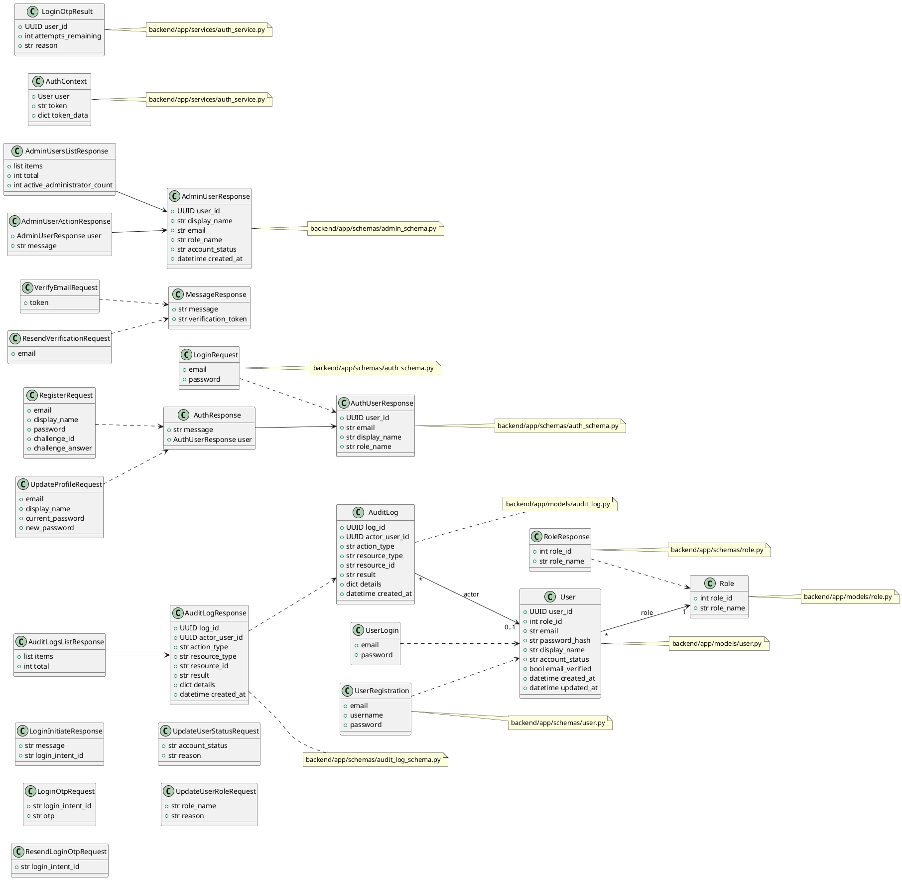

# FlagSync Project Structure Report

**Project Name:** FlagSync  
**Date Generated:** July 1, 2026  
**Purpose:** Complete inventory of project directories and files for ICT2216 Secure Software Development

---

## Executive Summary

This report provides a comprehensive listing of all directories and files in the FlagSync project. The project is structured as a full-stack web application with a Python FastAPI backend and a React frontend, organized for secure development practices.

## Top-Level Directories

The project root contains these main directories and files:

- `backend/` - Python FastAPI backend source, tests, and configuration
- `frontend/` - React/Vite frontend source, assets, and configuration
- `scripts/` - Utility scripts for project checks and automation
- `.github/` - GitHub workflow and dependency automation files
- `.vscode/` - Workspace settings
- `.agents/` - Agent customization files
- `.codex/` - Copilot/Codex workspace metadata
- `README.md` - Project documentation
- `.gitignore` - Git ignore rules
- `package.json` - Root Node.js package configuration
- `package-lock.json` - Root dependency lockfile

---

## Project Directory Tree

```
FlagSync/
├── .gitignore
├── README.md
├── package.json
├── package-lock.json
├── .github/
│   ├── dependabot.yml
│   └── workflows/
│       ├── cd.yml
│       └── ci.yml

├── scripts/
│   └── check.sh
│
├── .vscode/
│   └── settings.json
│
├── backend/
│   ├── .env.example
│   ├── pytest.ini
│   ├── requirements.txt
│   │
│   ├── app/
│   │   ├── database.py
│   │   ├── main.py
│   │   │
│   │   ├── models/
│   │   │   ├── audit_log.py
│   │   │   ├── role.py
│   │   │   └── user.py
│   │   │
│   │   ├── repositories/
│   │   │   ├── audit_log_repository.py
│   │   │   ├── role_repository.py
│   │   │   └── user_repository.py
│   │   │
│   │   ├── routers/
│   │   │   ├── admin.py
│   │   │   ├── audit_logs.py
│   │   │   ├── auth_router.py
│   │   │   └── roles.py
│   │   │
│   │   ├── schemas/
│   │   │   ├── admin_schema.py
│   │   │   ├── audit_log_schema.py
│   │   │   ├── auth_schema.py
│   │   │   ├── role.py
│   │   │   └── user.py
│   │   │
│   │   └── services/
│   │       ├── auth_service.py
│   │       └── email_service.py
│   │
│   └── tests/
│       ├── conftest.py
│       ├── test_admin.py
│       ├── test_auth_security.py
│       └── test_health.py
│
├── frontend/
│   ├── .env.example
│   ├── README.md
│   ├── eslint.config.js
│   ├── index.html
│   ├── package.json
│   ├── package-lock.json
│   ├── vite.config.js
│   │
│   ├── public/
│   │   ├── favicon.svg
│   │   └── icons.svg
│   │
│   │
│   └── src/
│       ├── App.css
│       ├── App.jsx
│       ├── index.css
│       ├── main.jsx
│       │
│       ├── api/
│       │   └── axiosClient.js
│       │
│       ├── assets/
│       │   ├── hero.png
│       │   ├── react.svg
│       │   └── vite.svg
│       │
│       ├── components/
│       │   ├── audit/
│       │   │   ├── AuditLogDetailsModal.css
│       │   │   └── AuditLogDetailsModal.jsx
│       │   ├── auth/
│       │   │   ├── LogoutButton.jsx
│       │   │   └── RequireGuest.jsx
│       │   ├── dashboard/
│       │   │   ├── DashboardLayout.css
│       │   │   ├── DashboardLayout.jsx
│       │   │   └── DashboardSidebar.jsx
│       │   └── public/
│       │       ├── PublicLayout.css
│       │       └── PublicLayout.jsx
│       │
│       ├── data/
│       │   ├── previewEvents.js
│       │   └── previewUsers.js
│       │
│       ├── hooks/
│       │   └── useSessionUser.js
│       │
│       ├── pages/
│       │   ├── account/
│       │   │   ├── ProfilePage.css
│       │   │   └── ProfilePage.jsx
│       │   ├── administrator/
│       │   │   ├── AdminDashboardPage.jsx
│       │   │   ├── AdminUsersPage.css
│       │   │   ├── AdminUsersPage.jsx
│       │   │   ├── AuditLogsPage.css
│       │   │   └── AuditLogsPage.jsx
│       │   ├── errors/
│       │   │   ├── ForbiddenPage.css
│       │   │   ├── ForbiddenPage.jsx
│       │   │   └── NotFoundPage.jsx
│       │   ├── organiser/
│       │   │   ├── ManageEventsPage.css
│       │   │   ├── ManageEventsPage.jsx
│       │   │   └── OrganiserDashboardPage.jsx
│       │   ├── public/
│       │   │   ├── EventDetailsPage.css
│       │   │   ├── EventDetailsPage.jsx
│       │   │   ├── EventsPage.css
│       │   │   ├── EventsPage.jsx
│       │   │   ├── HomePage.jsx
│       │   │   ├── LoginOtpPage.jsx
│       │   │   ├── LoginPage.jsx
│       │   │   ├── RegisterPage.jsx
│       │   │   └── VerifyEmailPage.jsx
│       │   └── user/
│       │       ├── RegisteredEventsPage.css
│       │       ├── RegisteredEventsPage.jsx
│       │       └── UserDashboardPage.jsx
│       │
│       ├── routes/
│       │   └── AppRoutes.jsx
│       │
│       ├── services/
│       │   ├── accountService.js
│       │   ├── adminUserService.js
│       │   ├── auditLogService.js
│       │   ├── authService.js
│       │   ├── auth_service.js
│       │   └── roleService.js
│       │
│       └── utils/
│           ├── auditLogAccess.js
│           ├── auditLogPresentation.js
│           ├── auditLogPresentation.test.js
│           ├── authSession.js
│           ├── eventPresentation.js
│           ├── eventRegistrationSession.js
│           └── roleRoutes.js

```

---

## Detailed Directory Breakdown

### `backend/`

| Directory/File | Description |
|---|---|
| `app/main.py` | FastAPI application entry point |
| `app/database.py` | Database connection and configuration |
| `app/models/` | SQLAlchemy ORM model definitions |
| `app/repositories/` | Data access layer (Repository pattern) |
| `app/routers/` | API route handlers organized by domain |
| `app/schemas/` | Pydantic schemas for request/response validation |
| `app/services/` | Business logic layer (authentication, email, etc.) |
| `tests/` | Unit and integration tests |
| `requirements.txt` | Python dependencies |
| `pytest.ini` | Pytest configuration |
| `.env.example` | Environment variables template |

### `frontend/`

| Directory/File | Description |
|---|---|
| `src/main.jsx` | React application entry point |
| `src/App.jsx` | Root React component |
| `src/components/` | Reusable UI components |
| `src/pages/` | Full-page components for routing |
| `src/services/` | API client services |
| `src/hooks/` | Custom React hooks |
| `src/routes/` | Route definitions |
| `src/utils/` | Helper functions and utilities |
| `vite.config.js` | Vite build configuration |
| `eslint.config.js` | ESLint configuration |
| `package.json` | Node.js dependencies |
| `.env.example` | Environment variables template |

### Root Level

| File | Description |
|---|---|
| `package.json` | Monorepo root dependencies |
| `README.md` | Project documentation |
| `.gitignore` | Git ignore rules |

### CI/CD Pipeline (`/.github/workflows/`)

| File | Description |
|---|---|
| `ci.yml` | Continuous Integration workflow (testing, linting) |
| `cd.yml` | Continuous Deployment workflow |
| `dependabot.yml` | Automated dependency updates |

---

## File Statistics

### Backend
- **Total Python Files:** 18
- **Test Files:** 4
- **Model Files:** 3
- **Router Files:** 4
- **Schema Files:** 5
- **Repository Files:** 3
- **Service Files:** 2

### Frontend
- **Component Files:** 13
- **Page Files:** 11
- **Service Files:** 6
- **Utility Files:** 7
- **Configuration Files:** 6
- **CSS Files:** 8
- **JSX Components:** 24

---

## Architecture Overview

### Backend Architecture
The backend follows a **layered architecture pattern**:
- **Routers:** HTTP request handling
- **Services:** Business logic and domain operations
- **Repositories:** Data persistence and queries
- **Models:** Database schema definitions
- **Schemas:** Request/response validation

### Frontend Architecture
The frontend follows a **component-based architecture**:
- **Pages:** Full-page views corresponding to routes
- **Components:** Reusable UI components
- **Services:** API client integration
- **Hooks:** Shared stateful logic
- **Utils:** Helper functions and constants

## Class Diagrams

The diagrams below map the main runtime classes and module-level structures back to the files listed in this report. For React files, the function components are shown as UML classes so the diagram can still express their relationships clearly.

### Backend Domain Model and DTOs



### Backend Module Dependencies

```plantuml
@startuml
left to right direction

class MainModule {
	+startup_database()
	+_seed_reference_data()
	+health_check()
	+database_health_check()
}

class AuthRouter {
	+registration_challenge()
	+register()
	+resend_verification()
	+login()
	+verify_login_otp()
	+logout()
	+me()
	+update_profile()
	+delete_account()
}

class AdminRouter {
	+list_admin_users()
	+update_user_status()
	+delete_user()
	+update_user_role_endpoint()
}

class RolesRouter {
	+list_roles()
	+retrieve_role()
}

class AuditLogsRouter {
	+retrieve_audit_logs()
}

class AuthService {
	+authenticate_user()
	+create_access_token()
	+decode_access_token()
	+require_roles()
	+record_audit_event()
	+create_login_otp()
	+consume_login_otp()
	+create_email_verification_token()
	+validate_password_policy()
}

class EmailService {
	+send_verification_email()
	+send_login_otp_email()
}

class UserRepository {
	+get_user_by_email()
	+get_user_by_id()
	+create_user()
	+update_user_profile()
	+deactivate_user()
	+get_users_paginated()
	+count_active_administrators()
	+update_user_account_status()
	+update_user_role()
}

class RoleRepository {
	+get_all_roles()
	+get_role_by_id()
	+get_role_by_name()
}

class AuditLogRepository {
	+create_audit_log()
	+list_audit_logs()
	+get_audit_logs_paginated()
}

class DatabaseSession {
	+get_db()
	+SessionLocal
	+engine
}

MainModule --> AuthRouter
MainModule --> AdminRouter
MainModule --> RolesRouter
MainModule --> AuditLogsRouter
MainModule --> DatabaseSession

AuthRouter --> AuthService
AuthRouter --> EmailService
AuthRouter --> UserRepository
AuthRouter --> RoleRepository
AuthRouter --> DatabaseSession

AdminRouter --> AuthService
AdminRouter --> UserRepository
AdminRouter --> RoleRepository
AdminRouter --> AuditLogRepository
AdminRouter --> DatabaseSession

RolesRouter --> AuthService
RolesRouter --> RoleRepository
RolesRouter --> DatabaseSession

AuditLogsRouter --> AuthService
AuditLogsRouter --> AuditLogRepository
AuditLogsRouter --> DatabaseSession

note for MainModule "backend/app/main.py"
note for AuthRouter "backend/app/routers/auth_router.py"
note for AdminRouter "backend/app/routers/admin.py"
note for RolesRouter "backend/app/routers/roles.py"
note for AuditLogsRouter "backend/app/routers/audit_logs.py"
note for AuthService "backend/app/services/auth_service.py"
note for EmailService "backend/app/services/email_service.py"
note for UserRepository "backend/app/repositories/user_repository.py"
note for RoleRepository "backend/app/repositories/role_repository.py"
note for AuditLogRepository "backend/app/repositories/audit_log_repository.py"
note for DatabaseSession "backend/app/database.py"
@enduml
```

### Frontend Component and Route Graph

```plantuml
@startuml
left to right direction

class App {
	+render()
}

class AppRoutes {
	+route configuration
}

class RequireGuest {
	+guard for guest-only routes
}

class PublicLayout {
	+header
	+footer
	+navigation
}

class DashboardLayout {
	+dashboard shell
	+stats
	+actions
	+activity
}

class DashboardSidebar {
	+role links
}

class LogoutButton {
	+logout action
}

class useSessionUser {
	+session sync hook
}

class authService {
	+login()
	+register()
	+logout()
	+getCurrentUser()
	+updateCurrentUser()
	+deleteCurrentUser()
	+verifyEmail()
}

class adminUserService {
	+getAdminUsers()
	+updateAdminUserStatus()
	+updateAdminUserRole()
}

class auditLogService {
	+getAuditLogs()
}

class roleRoutes {
	+getDashboardPath()
	+canRegisterForEvents()
}

class PublicPages {
	+HomePage
	+LoginPage
	+LoginOtpPage
	+RegisterPage
	+VerifyEmailPage
	+EventsPage
	+EventDetailsPage
}

class AdminPages {
	+AdminDashboardPage
	+AdminUsersPage
	+AuditLogsPage
}

class OrganiserPages {
	+OrganiserDashboardPage
	+ManageEventsPage
}

class UserPages {
	+UserDashboardPage
	+RegisteredEventsPage
}

class AccountPages {
	+ProfilePage
}

class ErrorPages {
	+ForbiddenPage
	+NotFoundPage
}

class AuditLogDetailsModal {
	+log details modal
}

App --> AppRoutes
AppRoutes --> RequireGuest
AppRoutes --> PublicPages
AppRoutes --> AdminPages
AppRoutes --> OrganiserPages
AppRoutes --> UserPages
AppRoutes --> AccountPages
AppRoutes --> ErrorPages

PublicLayout --> useSessionUser
PublicLayout --> LogoutButton
DashboardLayout --> DashboardSidebar
RequireGuest --> useSessionUser
RequireGuest --> roleRoutes
LogoutButton --> authService
DashboardSidebar --> roleRoutes

PublicPages --> PublicLayout
AdminPages --> DashboardLayout
OrganiserPages --> DashboardLayout
UserPages --> DashboardLayout
AuditLogDetailsModal --> auditLogService

AppRoutes --> roleRoutes
AppRoutes --> authService
AppRoutes --> adminUserService
AppRoutes --> auditLogService

note for App "frontend/src/App.jsx"
note for AppRoutes "frontend/src/routes/AppRoutes.jsx"
note for RequireGuest "frontend/src/components/auth/RequireGuest.jsx"
note for PublicLayout "frontend/src/components/public/PublicLayout.jsx"
note for DashboardLayout "frontend/src/components/dashboard/DashboardLayout.jsx"
note for DashboardSidebar "frontend/src/components/dashboard/DashboardSidebar.jsx"
note for LogoutButton "frontend/src/components/auth/LogoutButton.jsx"
note for useSessionUser "frontend/src/hooks/useSessionUser.js"
note for authService "frontend/src/services/authService.js and frontend/src/services/auth_service.js"
note for adminUserService "frontend/src/services/adminUserService.js"
note for auditLogService "frontend/src/services/auditLogService.js"
note for roleRoutes "frontend/src/utils/roleRoutes.js"
note for AuditLogDetailsModal "frontend/src/components/audit/AuditLogDetailsModal.jsx"
note for PublicPages "frontend/src/pages/public/*.jsx"
note for AdminPages "frontend/src/pages/administrator/*.jsx"
note for OrganiserPages "frontend/src/pages/organiser/*.jsx"
note for UserPages "frontend/src/pages/user/*.jsx"
note for AccountPages "frontend/src/pages/account/*.jsx"
note for ErrorPages "frontend/src/pages/errors/*.jsx"
@enduml
```

---

## Key Features Based on Structure

### User Management
- User authentication and authorization
- User profiles and account management
- Role-based access control

### Audit Logging
- Audit trail for system actions
- Audit log viewing interface with details modal

### Admin Dashboard
- User management interface
- Audit log management
- Role management

### Event Management
- Event listing and details
- Event registration
- Organizer event management

---

## Security Components Identified

1. **Authentication:** `auth_service.py`, `auth_router.py`
2. **Authorization:** Role-based access control via routers and schemas
3. **Audit Logging:** Comprehensive audit trail implementation
4. **Email Verification:** `email_service.py`, verification flow in pages
5. **OTP Authentication:** `LoginOtpPage.jsx`

---

## Configuration Files

### Python Backend
- `pytest.ini` - Testing configuration
- `requirements.txt` - Dependency management
- `.env.example` - Environment template

### Frontend
- `vite.config.js` - Build tool configuration
- `eslint.config.js` - Code quality standards
- `package.json` - Dependency management

### CI/CD
- `.github/workflows/ci.yml` - Automated testing
- `.github/workflows/cd.yml` - Deployment pipeline

---

## Development Tools

- **Backend:** FastAPI, SQLAlchemy, Pytest, Ruff (linting)
- **Frontend:** React, Vite, Axios, ESLint
- **Package Managers:** pip (Python), npm (Node.js)
- **Version Control:** Git (with GitHub workflows)

---

## Report Q&A Quick Reference

Use the following answers when preparing common report questions about this repository:

1. **What architecture pattern does FlagSync use?**  
   It is a full-stack web application with a React/Vite frontend (`frontend/src`) and a FastAPI backend (`backend/app`), connected through REST API routes mounted in `backend/app/main.py`.

2. **How is authentication implemented?**  
   Authentication is handled through `/api/auth` endpoints in `backend/app/routers/auth_router.py`, including registration challenge validation, login, OTP verification (`/login/verify-otp`), and logout.

3. **How does authorization work?**  
   The backend enforces role-based access using roles seeded at startup (`administrator`, `organiser`, `user`) in `backend/app/main.py`, and frontend route guards enforce allowed roles in `frontend/src/routes/AppRoutes.jsx`.

4. **Where are key security controls located?**  
   Security headers and no-store headers are applied in middleware in `backend/app/main.py`, while password policy, token/session logic, and audit logging helpers are centralized in `backend/app/services/auth_service.py`.

5. **How is auditing handled?**  
   Audit events are recorded from auth and admin flows via `record_audit_event(...)` calls in backend services/routers and exposed to administrators through backend audit routes and the frontend page `frontend/src/pages/administrator/AuditLogsPage.jsx`.

6. **What quality gates are already defined?**  
   The repository includes frontend lint/build checks, backend Ruff + Pytest checks, and security tooling (Bandit, npm audit, pip-audit) in `scripts/check.sh`, plus CI workflows under `.github/workflows/`.

7. **What are the main user journeys in the frontend?**  
   Public flows include home, login, registration, and event browsing; authenticated flows include dashboards and role-specific pages for users, organisers, and administrators, all defined in `frontend/src/routes/AppRoutes.jsx`.

8. **How is service health monitored?**  
   Backend health endpoints are available at `/`, `/api/health`, and `/api/health/database` in `backend/app/main.py`.

---

## Excluded from This Report

The following directories/files were excluded from this listing as they are auto-generated or dependencies:
- `.venv/` - Python virtual environment
- `node_modules/` - Node.js dependencies
- `__pycache__/` - Python cache
- `.pytest_cache/` - Test cache
- `.ruff_cache/` - Linter cache
- `.git/` - Git repository data

---

**End of Report**

*This report was generated for ICT2216 Secure Software Development Team Project*
